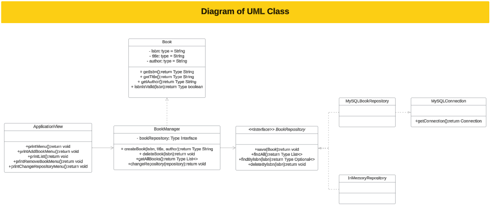

Tech Books Manager App 📗

🎯 Project objectives:

• Introduces us to OOP.
• Develop an incremental project.
• Start applying refactor techniques.
• Getting closer little by little to Spring Boot architecture.

⚙️ Functions:

BookManager is a Java-based application designed to efficiently manage a collection of programming books. It offers a user-friendly interface to perform the following operations:

1.  Add new books: Allows users to input details such as title, author, ISBN, and publication year for a new book.
2.  See all books: Displays a list of all books in the collection, including their details.
3.  Delete existing books: Enables users to remove a specific book from the collection based on its ID or other criteria.
4.  Switch between console and DB repositories: Switches between console-based and database-based storage for the book collection.
5.  Exit: Terminates the application.

💻 Technology Stack:

1.  
2.  
3.  
4.  
5.  

## Project Structure
        |--- src
            |--- main
                |--- java
                    |---org.example
                    |--- config
                        |--- MySQLConnection
                    |--- logic
                        |--- Book
                        |--- BookManager
                        |--- BookRepository
                    |--- persistance
                        |--- InMemoryRepository
                        |--- MySQLBookRepository
                    |--- presentation
                        |--- ApplicationView
                    |--- Main
        |--- test
            |--- java
                |--- org.example.persistance
                    |--- InMemoryRepositoryTest
## Demo

## Authors
    • Monica Simó (https://github.com/monicasimoF5)
    • Andrea Celmare (https://github.com/andreeaclmr)
    • Stefano Micciche (https://github.com/StefanoMicciche)
    • Paola Perdomo (https://github.com/Paola077)

